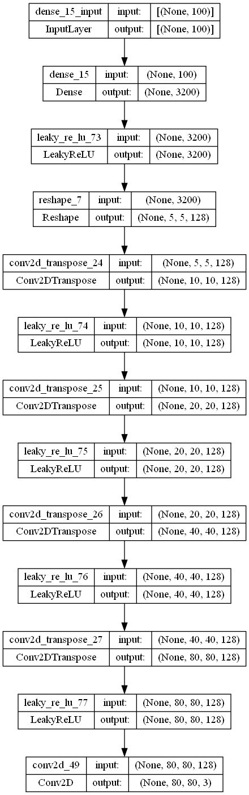

# gan-animal-synthesis

Access result from this repo on streamlit web app by clicking on the badge above or directly via the link https://gan-animal-synthesis.streamlit.app/.

# TL;DR - Hacking phase
I used DCGAN, WGAN-GP, cGAN and cWGAN-GP to generate the faces of mixed animals.
I tested it on three datasets: LHI, AFHQ and AFD. This was evaluated qualitatively by analyzing synthetic images. I explored interpolation on latent space to mix images together as well. 
You can find model implementation in consecutive python scripts. Data preparation is in notebook [Ganimals - Dataset loading and processing.ipynb](Ganimals%20-%20Dataset%20loading%20and%20processing.ipynb). Training and results of each experiment are in notebooks specified. Output files with data can be found in `ganimals` folder (I didn't include initial .zip files with data but only preprocessed .npz due to large size of orginal image data).

# Goal
Obtain animal "hybrid" synthetic images generated by GAN models by training the models on images of different animal faces.

## Evaluation metric
The problem with GAN models is that there is no way to objectively assess the progress of the training and the quality of the model from loss alone. It is common to evaluate the model performance qualitatively based on the quality and diversity of generated images [[1]](#1). This will be done manually in two phases:
1. Training phase: a bunch of fake images will be generated every 10th epoch and saved in order to assess model training.
2. Testing phase: after picking the best performing model on the basis of 1.) (I expect it to be the last epoch), new images are gonna be generated and assessed.

In order to evaluate the fake images I will be looking for the following:
- the quality of images - the amount of noise and blur
- formation on low-level features - general shapes of animals
- formation on high-level features  - e.g. eyes, ears of animals present in the image
- diversity - whether a model produces distinct types of animals, not only the majority of one type e.g. mainly dog-like images
- "hybridization" - whether the model tries to mix different types of animals together

# Solution
I picked **DCGAN** as my baseline since it's popular and widely implemented for standard generating images with generative adversarial networks. I tested it on three datasets to determine their usefulness. 
Next, I tried to improve my results with Wassersetin GAN with gradient penalty (**WGAN-GP**). This variation is reported to improve the stability while training and has more interpretable loss correlated to generated image quality.
Further in the project, another approach was tried by using conditional GAN models that condition the output data distribution on animal class. The advantage here is that restricting generation of images for a particular class should improve the quality of fake images. Conditional GAN models embed classes in high-dimensional latent space. Then, the latent space can be traversed such that synthesizing experimental hybrid animals is done by interpolating through classes.
Interpolation in latent space was also done for previous models, however, they in theory already mix different types of animals as there are no restrictions on data distribution for the generator.
During this experiment phase, I used **CGAN** model and transformed the previously used WGAN-GP to **CWGAN-GP** to support conditioning. 

# Results achieved

## DCGAN 

### LHI
Notebook [Ganimals - DCGAN on LHI.ipynb](https://github.com/akrlowicz/gan-animal-synthesis/blob/main/Ganimals%20-%20DCGAN%20on%20LHI.ipynb)

The LHI dataset was the smallest (2k) images and after training the model for 100 epochs it still created noise as images. During the first attempt to train on it, the DCGAN model kept entering failure mode with discriminator loss of 0 (no more learning happening, there are no more loss gradients flowing, so weights of D and G are not modified). This dataset was therefore dropped further.

### AFHQ
Notebook [Ganimals - DCGAN on AFHQ.ipynb](https://github.com/akrlowicz/gan-animal-synthesis/blob/main/Ganimals%20-%20DCGAN%20on%20AFHQ.ipynb)

Fake image generated by models:

Examples of interpolation results:

Images saved during training looked blurry, however, during evaluation they were of high quality.
The model tried to combine different animals, but rather whole parts of it - like half of the face can be seen as coming from a different animal or only a mouth or even the whole face looks like pasted onto some other animal.
The important thing here is that it can be seen that they are animals and the model combined them into some sort of less fine-grained hybrids. Therefore, the goal was achieved. 
Interpolation between images using latent space yielded interesting results. Some of the middle images (interpolated) look better than the end images, incorporating some features like eyes from the first image that were not positioned properly or present in the second image.

### AFD
Notebook [Ganimals - DCGAN on AFD.ipynb](https://github.com/akrlowicz/gan-animal-synthesis/blob/main/Ganimals%20-%20DCGAN%20on%20AFD.ipynb)

Fake image generated by models:

Examples of interpolation results:

Images generated are generally more blurry, which was expected from this dataset (I upsize them to 80x80 size for the sake of the model architecture specified, but the original images were 64x64).
You can see some components of faces like nose/eyes in the images but transformed. Some images remble original animals, but no high-quality hybrid was obtained.
There is not much  variety in generated images, a lot of them resemble some type of monkey. This is the animal that is the most distinguishable. However, the goal of generating new faces was obtained, despite the failure in obtaining distinct hybrids. 
Therefore, also interpolation does not yield the most interesting results. Even if one of the pictures at the start/end resembles an animal, if the other does not the result comes out rather as blurred shapes in the middle. 

One of the disadvantages of DCGAN is that it's producing a limited variety of samples. Therefore another model tested was WGAN-GP.
The models below were trained on the AFD dataset.

## WGAN-GP
Notebook [Ganimals - WGAN on AFD.ipynb](https://github.com/akrlowicz/gan-animal-synthesis/blob/main/Ganimals%20-%20WGAN%20on%20AFD.ipynb)

Fake image generated by models:

Examples of interpolation results:

The architecture of both models differs a bit in the number of filters in convolutional layers, but WGAN-GP was trained for longer (200 epochs, DCGAN for 150 epochs). The observation from training was that it produced better images at the start - DCGAN first really creates just noise, WGAN produced some shapes with colors corresponding to training images. 
The generated images in comparison to results obtained from baseline DCGAN tend to be noisy with less meaningful details, despite the model being trained for longer. 
The overall shape most of the time does not resemble an animal, but rather is a blurry patch. Therefore, also higher-level features like ears and eyes are rather hard to spot and there is no way to judge  the "hybridization" of the images.

## cGAN
Notebook [Ganimals - conditional GAN and cWGAN.ipynb](https://github.com/akrlowicz/gan-animal-synthesis/blob/main/Ganimals%20-%20conditional%20GAN%20and%20cWGAN.ipynb)

Fake image generated by models for each class:

Examples of interpolation results:

Indeed, eyes are better preserved for cGAN with some other higher-level features.  
They tend to be a bit less blurry, however significant amount of noise is still present.  When interpolating between two classes, the images are also more diverse, which indicates that latent space is more complex.  Controlling which class category is interpolated is useful. Some mixed blurred hybrids are obtained, but rather hard to tell that they are animals

## cWGAN-GP
Notebook [Ganimals - conditional GAN and cWGAN.ipynb](https://github.com/akrlowicz/gan-animal-synthesis/blob/main/Ganimals%20-%20conditional%20GAN%20and%20cWGAN.ipynb)

Fake image generated by models for each class:

Examples of interpolation results:

cWGAN-GP still produces noisy pictures, only now you can try to differentiate different blur shapes. However, the features of animals are still not noticeable with high noise. WGANs could probably be trained for even longer to produce meaningful outputs.

Overall I should have stuck to the AFHQ dataset rather than AFD, which I was more tempted to experiment with due to the larger number of classes. AFD turned out to not be a good fit, because of image quality. AFHQ despite a small number of classes still had a lot of distinctive images, the classes were just more general (dog, cat, wildlife instead of specific species).

# Time breakdown
The hours stated below are an approximation of the actual time devoted to each of the phases.

More theoretical knowledge gathering: **actual: 20h, estimated: 5h**

Here, I needed to devote much more time and iteratively expand my understanding of different GAN architectures and tips for training them during the implementation phase

Dataset preparation: **actual=estimated:15h**

Finding the data and establishing a pipeline of processing needed for them to work with my models took around the time that was estimated.

GAN preparation: **actual=estimated:25h**

Implementation per se became easier during an iterative gathering of knowledge and also with the help of some tutorials. Tweaking the models to my needs took some time, but I believe the total hours devoted to that were close to the estimated time. 

Training iterations: **actual: 10h, estimated:40h**

Thanks to buying additional GPU units with Google Colab Pro I actually was able to reduce this time. Without Google Colab Pro, training of GAN models would take ~5h, which was reduced to even ~40min.
As a result, I obtained 6 trained models, however, there were some intermediate failed models that also took time to train.

Analysis of results: **actual: 5h, estimated:10h**

Gathering and presenting results with writing a report took around 5h.

## Appendix: Model architecture

Because it's taking up a lot of space.

## DCGAN
Discriminator (left) and generator architecture (right):

 

## WGAN-GP
Discriminator (left) and generator architecture (right):

 

## cGAN
Discriminator (left) and generator architecture (right):

 

## cWGAN-GP
Here it's shown how class are incorportated into conditional architecture via embedding layer. This is different implementation detail compared to cGAN as well, where classes are contacenated with the input in the training steps. 
Particular architecture of discriminator and generator is the same as for WGAN-GP.
Discriminator (top) and generator architecture (bottom):

 

# References
<a id="1">[1]</a>  https://machinelearningmastery.com/how-to-evaluate-generative-adversarial-networks/
